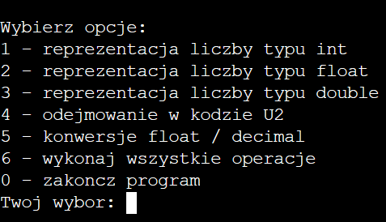
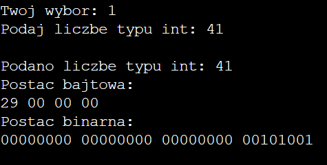
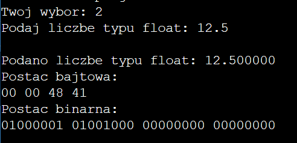
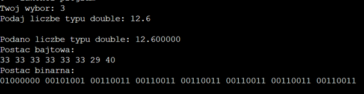
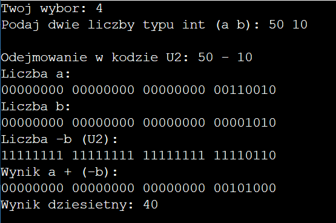
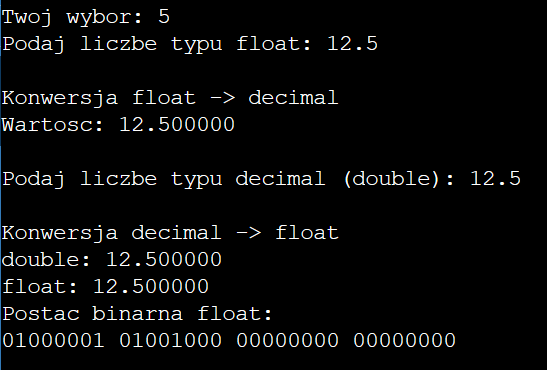

# Data Representation in C

Projekt wykonany w ramach przedmiotu  
**Architektura systemów komputerowych**

## Opis projektu

Program konsolowy napisany w języku C, demonstrujący sposób reprezentacji
danych liczbowych w pamięci komputera oraz mechanizmy ich przetwarzania.

Aplikacja umożliwia analizę:
- bajtowej i binarnej reprezentacji danych typu `int`, `float` oraz `double`,
- odejmowania liczb całkowitych w kodzie uzupełnień do dwóch (U2),
- konwersji pomiędzy formatami `float` oraz `decimal` (`double`)
  zgodnie ze standardem IEEE 754.

## Funkcjonalności

Program umożliwia:
- wyświetlanie postaci bajtowej danych typu `int`, `float`, `double`,
- wyświetlanie binarnej reprezentacji liczb całkowitych i zmiennoprzecinkowych,
- prezentację odejmowania w kodzie U2 krok po kroku,
- konwersję `float → decimal` oraz `decimal → float`,
- wykonanie wszystkich operacji jednocześnie dla jednej wartości wejściowej.

## Przykładowe działanie programu

Poniżej przedstawiono zrzuty ekranu prezentujące działanie programu
dla wybranych funkcjonalności.

### Menu programu


### Reprezentacja liczby typu int


### Reprezentacja liczby typu float


### Reprezentacja liczby typu double


### Odejmowanie w kodzie U2


### Konwersje float ↔ decimal


## Kompilacja i uruchomienie

```bash
gcc main.c -o data_representation
./data_representation
```
